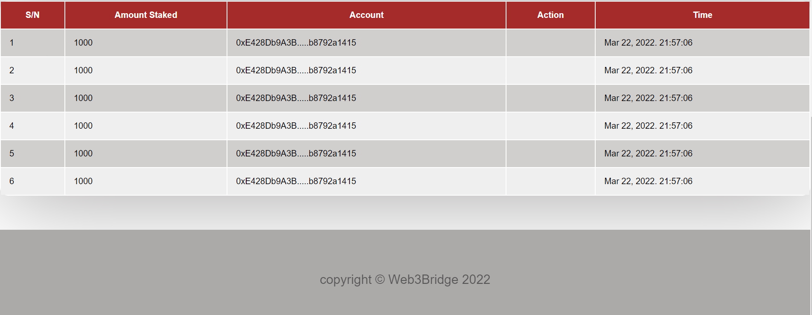

# Staking Protocol Frontend

> The Frontend Implementation

<!-- Additional description about the project and its features. -->

- This project is the implementation of the web3integration of staking contract to a frontend that enables users to stake and unstake plus check their staking history.
## Built With

- Reactjs
- Ethersjs
- CSS

## Live Link
- [Web3Frontend Staking Platform](https://mystake-web3.netlify.app/)

## Getting Started

To get a local copy up and running follow these simple example steps.

- Fork the repository
- Git clone https://github.com/your-username/web3integration
- git checkout -b branch name
- git remote add upstream https://github.com/jebitok-dev/web3integration
- git pull upstream master
- git commit -m "commit message"
- git push -u origin HEAD

## Author

👤 **Author**

- GitHub: [@Jebitok-dev](https://github.com/Jebitok-dev)

## 🤝 Contributing

Contributions, issues, and feature requests are welcome!

Feel free to check the [issues page](issues/).

## Show your support

Give a ⭐️ if you like this project!

## Acknowledgment

 I hereby acknowledge the instructors at [Web3Bridge](Web3Bridge.com) for taking us through smart contract development and Frontend Implementation.
<!-- - Inspiration
- etc --> 

<!-- ## 📝 License -->

<!-- This project is [MIT](lic.url) licensed. -->

